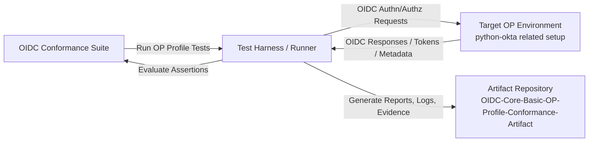

# OIDC Core Basic OP Profile Conformance Artifacts

This repository contains **artifacts and evidence** from running the **OpenID Connect (OIDC) Conformance Suite** against the [`python-okta`](https://github.com/okta/okta-sdk-python) related OIDC/OpenID Provider setup.

> **Note:** This is an artifact/evidence repository.  
> It is **not** an implementation codebase.

---

## Purpose

The goal of this repository is to:

- Preserve outputs from OIDC conformance test runs
- Provide traceable evidence for OIDC Core Basic OP Profile checks
- Make results easy to review and share for audits, troubleshooting, and reporting

---

## What this repository contains

Typical contents may include:

- Test run reports (HTML/JSON/text exports)
- Logs and request/response traces
- Screenshots of conformance results
- Configuration snapshots used during execution
- Notes on environment and test conditions

---

## Scope

This repository is focused on:

- **OIDC Core**
- **Basic OP (OpenID Provider) Profile**
- Conformance verification context related to `python-okta`

---

## OIDC Conformance Test Setup (Flow Diagram)



---

## Suggested artifact structure

If helpful, use a structure like:

```text
artifacts/
  YYYY-MM-DD/
    run-01/
      report.html
      summary.json
      logs/
      screenshots/
      config/
```

---

## How to use this repository

1. Run OIDC conformance tests in your target environment.
2. Collect outputs (reports/logs/screenshots/config notes).
3. Add them into a dated folder in this repository.
4. Commit with clear messages (test profile, date, environment details).
5. Use PRs/issues for review and tracking if needed.

---

## Naming recommendations

- Folder format: `YYYY-MM-DD/run-XX`
- Include profile name in filenames when possible
  - Example: `oidc-core-basic-op-report.html`
- Keep environment notes alongside artifacts for reproducibility

---

## Disclaimer

Artifacts may include sensitive operational details (URLs, client IDs, logs).  
Review and sanitize before publishing or sharing broadly.

---

## License

Add a license if/when needed for artifact sharing policy.
